# BigQuery Release Explorer: Architecture & Code Guide

This guide breaks down the BigQuery Release Notes web application, explaining its features, components, and how data flows between the server and the client.

---

## 🌟 Main Features

1. **Live Feed Aggregation**: Real-time integration with Google Cloud's BigQuery Atom feed.
2. **Granular Separation of Updates**: BigQuery releases are published daily in a single feed entry. The app splits these daily entries into individual change items (e.g. distinguishing a `Feature` from a `Change` or `Breaking` update under the same date).
3. **Keyword Search & Category Filter**: Instant front-end filtering by keyword text or release type pills.
4. **Smart Tweet Composer**: Auto-generates a formatted draft based on the selected update.
5. **Twitter Character Budgeting**: Computes remaining character counts (accounting for Twitter's automatic 23-character URL shortening wrapper) and visualizes the countdown.
6. **Direct Post Intent**: Opens a new window directly with Twitter/X's official share intent.

---

## 🖥️ Server-Side Architecture (`app.py`)

The backend is built with **Python Flask** and acts as a lightweight proxy, data parser, and content transformer. It does not use a database, fetching notes dynamically.

### Key Components

- **Flask Routes**:
  - `GET /`: Renders [templates/index.html](file:///Users/andrea/ai/agy-cli-projects/bigquery-release-viewer/templates/index.html).
  - `GET /api/releases`: Serves as the data API. It requests the XML feed, processes it, and outputs structured JSON.
- **Feed Processing Pipeline**:
  ```
  Fetch XML Feed ➔ Parse XML elements ➔ Split entry by <h3> ➔ Strip HTML tags ➔ Truncate & build Tweet drafts ➔ Deliver JSON
  ```
- **Custom XML/HTML Parsing Logic**:
  - Uses standard `xml.etree.ElementTree` with Namespace mapping (`http://www.w3.org/2005/Atom`) to extract entries.
  - Splits entries by the `<h3>` header tag using Python `re.split()`. Since Google format separates multiple daily updates with `<h3>[Type]</h3>`, this breaks a daily entry into logical pieces.
  - Normalizes whitespace and strips tags using `re.sub(r'<[^<]+?>', '', text)`.
  - Truncates raw text to fit within 280 characters alongside the generated release link:
    $$\text{Available Length} = 280 - \text{Prefix Length} - 23 \text{ (URL)} - 1 \text{ (Space)}$$

---

## 🎨 Client-Side Architecture

The frontend is a single-page application (SPA) implemented with vanilla HTML5, CSS3, and JavaScript.

### 1. Structural Markup (`templates/index.html`)
- Structured with semantic HTML5 (`<header>`, `<main>`, `<section>`, `<aside>`, `<footer>`).
- Divided into a responsive grid: main feed column (left) and sticky sidebar composer (right).
- Includes SVG graphics inline to avoid loading delays.

### 2. State & DOM Controller (`static/js/app.js`)
Manages state, DOM updates, and inputs in real time:
- **Application State Object**:
  ```javascript
  let state = {
      updates: [],         // Array of parsed updates from API
      selectedUpdate: null, // Selected update card details
      activeFilter: 'all',  // 'all', 'Feature', 'Change', etc.
      searchQuery: ''       // Keyboard input query string
  };
  ```
- **Key Functions**:
  - `fetchReleases()`: Requests JSON from the backend, manages spinners, and updates counters.
  - `renderFeed()`: Filters `state.updates` by search input and pill filter, groups the results by `date`, and constructs the HTML list cards.
  - `selectUpdate()`: Populates the composer fields when a user clicks a feed card.
  - `calculateTweetLength()`: Counts characters by replacing any embedded links with a 23-character budget placeholder to match Twitter/X's real counting engine.

### 3. Glassmorphic CSS System (`static/css/style.css`)
- **Theme**: Dark mode centered around `#0a0f1d` with deep-space glowing background blobs (`.glow-orb`).
- **Glassmorphism**: Backdrop blur filters (`backdrop-filter: blur(16px)`) and semi-transparent borders represent a premium frosted-glass design.
- **Dynamic Borders**: Selecting a card highlights it with a colored glow corresponding to the update type (green for Features, red for Breaking, blue for Changes).

---

## 🔄 Sample Request-Response Flow

Here is exactly what happens when you click **"Refresh Feed"**:

```mermaid
sequenceDiagram
    autonumber
    actor User as User
    participant Browser as Browser (JS App)
    participant Flask as Flask Server (app.py)
    participant BQFeed as BigQuery XML Feed (Google Cloud)

    User->>Browser: Click "Refresh Feed" button
    activate Browser
    Browser->>Browser: Start spinner & hide main list
    Browser->>Flask: GET /api/releases
    activate Flask
    Flask->>BQFeed: GET docs.google.com/.../bigquery-release-notes.xml
    activate BQFeed
    BQFeed-->>Flask: HTTP 200 OK (XML Content)
    deactivate BQFeed
    
    rect rgb(20, 30, 50)
        Note over Flask: Parser Pipeline:<br/>1. ET.fromstring(XML)<br/>2. Split by <h3> tags<br/>3. Strip HTML for clean text<br/>4. Generate tweet draft & format links
    end

    Flask-->>Browser: HTTP 200 OK (JSON response with 60 updates)
    deactivate Flask
    
    rect rgb(20, 30, 50)
        Note over Browser: Render Pipeline:<br/>1. Calculate overall counts (Features, Changes, etc.)<br/>2. Filter items based on active pills/search<br/>3. Group by date & generate HTML cards<br/>4. Stop spinner and render to screen
    end
    
    Browser-->>User: Refresh complete, show dashboard stats & update list
    deactivate Browser
```



---

## 🐦 Tweet Composition Flow

When you select an update and tweet:

1. **Card Selection**: Clicking a card executes `selectUpdate()`, copying the card's generated `tweet_text` into the text area.
2. **Interactive Editing**: Editing the text triggers `handleComposerTextChange()` which:
   - Calculates the length of the string, treating URLs as 23 characters.
   - Adjusts the SVG progress ring `strokeDashoffset`.
   - Disables the "Post on X" button if characters remaining $< 0$.
3. **Trigger Web Intent**: Clicking "Post on X" opens a new tab directed to:
   `https://twitter.com/intent/tweet?text={URLEncodedContent}`
   This navigates to Twitter/X's server and populates the composer automatically with your custom text.
